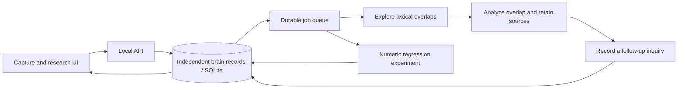

# Continuum — reusable brain framework

A working local foundation for the second-brain architecture. Each brain owns its sources, connections, background jobs, direction, and experiments. Jarvis, Sarai, and an astrology app can each use an independent instance of this framework.

## Visual direction

The overview is now a six-panel command center: graph spanning the left two columns, stacked source index and selected-node context on the right, and captures/insights/ask along the bottom. The interface follows the supplied futuristic dashboard references: geometric Continuum lettering, metallic hexagonal emblem, cyan/amber panels, a central source constellation, and a mobile navigation strip. The HIVEMIND image was used as typography inspiration, not as a product rename or an identified font. The graph now uses a Three.js/WebGL 2 renderer with a volumetric plasma sphere, turbulent particle shells, branching electrical pulses, and interactive source nodes. It offers camera parallax, an expanded view, and Auto/Cinematic quality modes. No image is used by the renderer. Empty-memory branches demonstrate motion rather than stored knowledge. See [visual design](VISUAL-DIRECTION.md).

## Hosted interface

The interface is deployed at https://continuum-brain.vercel.app. Its cloud backend is not connected. Browser import previews and prepared downloads work on the hosted interface; saving knowledge and running research still require the local app. See [deployment status](DEPLOYMENT.md) for verification and remaining work.

## Open and run

Open **http://127.0.0.1:4173/** while the local services are running.

From this directory, run:

```powershell
python run.py
```

Keep that terminal running; Ctrl+C stops the services it started. The launcher refuses occupied ports instead of stopping another app. Python 3.10+ and Node.js are required. Frontend dependencies are already installed in this workspace; on a fresh checkout run `npm ci`. The Python backend requires no third-party packages.

Optional initial knowledge: `python backend/seed.py`. This loads four clearly labeled notes from the user's design brief. It is idempotent and does not present those notes as independently verified science.

## What works

- Create separate brains and set their direction. New brains start empty.
- Snapshot-fork sources and direction with new source IDs and fresh analysis. Forks evolve independently; models, experiment datasets, and review decisions are not copied.
- Capture observations and preview imports from ChatGPT conversations.json, TXT, Markdown, and text-based PDFs. Select sources and a destination brain, inspect provenance, skip duplicates, and track source scans. Extracted text persists in SQLite; original PDF files are not stored. See [import instructions](INGESTION.md).
- Background worker: explore source overlaps → analyze term similarity → record a follow-up inquiry. Jobs survive a service restart. Pause and per-brain job allowances control dispatch.
- Inspect a source graph, review candidate associations, and open both original sources. Graph view shows up to 24 recent sources; lists retain all sources.
- Ask for matching passages with exact source citations. This is lexical retrieval, not a generated conversational answer.
- Run numeric regression experiments from CSV. Compare constant, single-feature linear, and median-split stump models using an ordered 60/20/20 split. Select on validation, refit on the first 80%, and evaluate the winner on the held-out final 20%. Export results and fitted parameters.
- Export the visible brain snapshot as JSON. It includes sources, links, latest 100 jobs, and experiment reports; it is not a complete database backup or a restore format. For a full backup, stop the service and copy `data/brain.db`.

## Pipeline



The service keeps running while the computer and launcher remain active. It waits when there is no queued work. This first engine does not autonomously research its follow-up questions or generate new ideas. A running service is not the same as continuously training a model.

## Boundaries and next adapters

Generative reasoning, embeddings/semantic RAG, entity-and-claim graph extraction, web/video/PDF connectors, deep learning, reinforcement learning, and remote authenticated access are **not connected**. Direction is currently stored context; the lexical baseline does not interpret it. The graph contains source associations rather than extracted semantic claims. The current unit of allowance is a job, not model tokens or money.

The next architecture seam is replacing the exploration, analysis, and retrieval implementations behind explicit provider contracts while retaining provenance and per-brain isolation. RepoForge can describe and validate those adapter contracts; linking repositories alone does not implement them. See the sibling architecture and RepoForge mapping documents.

This is a local development app, bound to loopback. The working local backend is not published or accessible from your phone away from this computer. The separate hosted interface has no connected memory service yet. Sources are unencrypted local files. Do not expose the service publicly without authentication and a deployment design. One backend process should own a database. Processing and snapshot polling currently read full source collections; pagination, incremental indexes, and scheduler fairness are needed for large collections.

The AutoML baseline is deliberately small: 30–5,000 complete numeric rows, up to 20 input columns, and a 200 KB UI import limit. Predictive accuracy does not establish causation. Dataset leakage, grouping, relevance, and repeated test-set reuse require task-specific evaluation.

## Verification

```powershell
python -m unittest discover -s backend -v
node node_modules/typescript/bin/tsc --noEmit
npm run build
```

Ten backend tests cover instance isolation, deduplication, forks, evidence links, pause/budget, interrupted-job recovery, cross-brain review rejection, numeric validation, held-out model comparison, and a live disposable HTTP service exercising the full pipeline. Frontend type checking and the production bundle build were also run. Browser interaction and visual QA have not been performed.

## Files

- `backend/brain.py`: durable memory and job engine
- `backend/server.py`: loopback HTTP service
- `backend/lab.py`: reproducible model search
- `app/page.tsx`: working research interface
- `app/knowledge-graph.tsx`: source graph
- `app/laboratory.tsx`: experiment controls and results
- `data/brain.db`: private local state, excluded from version control

API port defaults to 8787 (`BRAIN_PORT` override); database location supports `BRAIN_DB`. Vite on port 4173 proxies `/api` to the local backend.

### Motion verification

`node --test tests/neural-model.test.mjs` checks empty-memory honesty, deterministic source placement, valid edge filtering, bounded motion, and reduced-motion geometry. The canvas caps its pixel ratio and frame rate, stops off-screen or in a hidden tab, and offers a motion pause control. Browser animation/performance QA remains unperformed because no browser is connected. The supplied YouTube Short could not be retrieved, so its precise animation was not verified.
